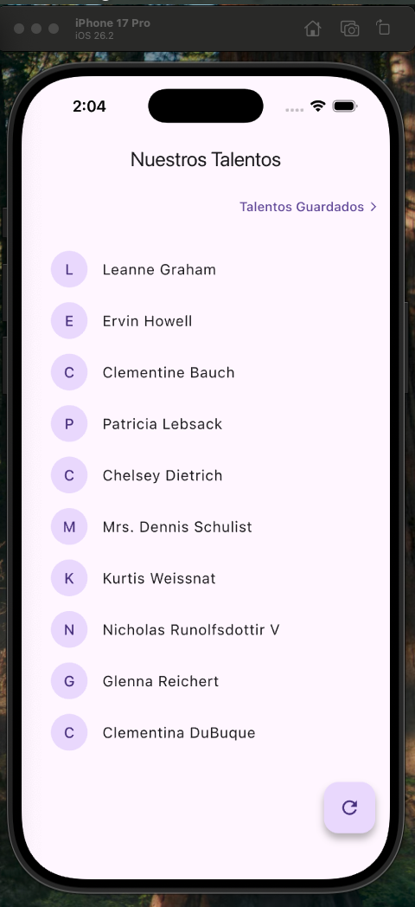
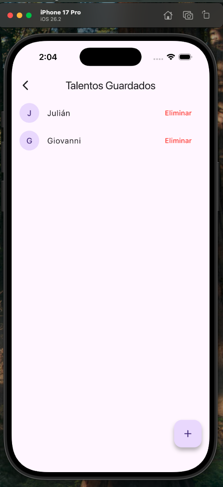

# 🌟 Talent Hub - Flutter App

**Talent Hub** es una aplicación móvil desarrollada en Flutter que permite gestionar perfiles de talentos. La aplicación combina datos obtenidos de una API remota con una base de datos local para ofrecer una experiencia personalizada de gestión de usuarios.

## 🚀 Características

* **Listado de la API:** Visualización en tiempo real de talentos consumidos desde un servicio externo.
* **Gestión Local (CRUD):** Capacidad para registrar nuevos talentos personalizados directamente en el dispositivo.
* **Persistencia de Datos:** Uso de base de datos relacional local para mantener tus talentos guardados incluso sin conexión.
* **Arquitectura Limpia:** Separación clara de responsabilidades (Data, Domain, Presentation).

## 🛠️ Tecnologías Principales

* **Estado:** [Flutter Bloc/Cubit](https://pub.dev/packages/flutter_bloc)
* **Navegación:** [GoRouter](https://pub.dev/packages/go_router)
* **Base de Datos Local:** [Drift](https://drift.simonbinder.eu/) (SQLite)
* **Inyección de Dependencias:** [GetIt](https://pub.dev/packages/get_it)
* **Red:** [Dio](https://pub.dev/packages/dio)

---

## 📦 Instalación y Configuración

Sigue estos pasos para configurar el proyecto en tu entorno local:

### 1. Clonar el repositorio
```bash
git clone git@github.com:PercyTomicha/talent-hub.git
```

### 2. Configurar variables de entorno

El proyecto requiere un archivo `.env` para su correcto funcionamiento. Por seguridad, este archivo no se incluye en el repositorio.

1. Localiza el archivo `.env.example` en la raíz del proyecto.

2. Crea una copia y renómbrala a `.env`:

```bash
cp .env.example .env
```
3. Asegúrate de que las variables dentro de `.env` coincidan con la configuración de tu API.

### 3. Instalar dependencias
Descarga los paquetes necesarios de pub.dev:
```bash
flutter pub get
```

### 4. Generar código de persistencia (Drift)
Descarga los paquetes necesarios de pub.dev:
```bash
flutter pub run build_runner build --delete-conflicting-outputs
```

### 5. Ejecutar la aplicación
Una vez configurado todo, lanza el proyecto en un emulador o dispositivo físico:
```bash
flutter run
```


## 🏗️ Estructura de Arquitectura

El proyecto está organizado siguiendo los principios de Clean Architecture para garantizar escalabilidad y facilitar las pruebas unitarias:

* **Core**: Configuración global, clientes de red (Dio/ApiClient) y enrutamiento con GoRouter.

* **Commons**: Componentes visuales reutilizables (Banners de error, carga y elementos de lista).

* **Features**:

    - **Data**: Implementación de Repositorios, Modelos y DataSources (Remote y Local con Drift).
    - **Domain**: Entidades de negocio y Casos de Uso (Use Cases).
    - **Presentation**: Interfaz de usuario y gestión de estados mediante Cubits.

## 📝 Notas Adicionales

* **Base de Datos**: Si modificas las tablas en `app_database.dart`, es obligatorio repetir el comando del `Paso 4`.

* **API**: La aplicación requiere conexión a internet para la carga inicial de talentos desde el servidor.


### 📸 Capturas de Pantalla
<details>
  <summary>📱 Haz clic para ver las capturas de pantalla</summary>
  
  ### Pantalla de Inicial
  
  
  ### Talentos Guardados Localmente
  
</details>